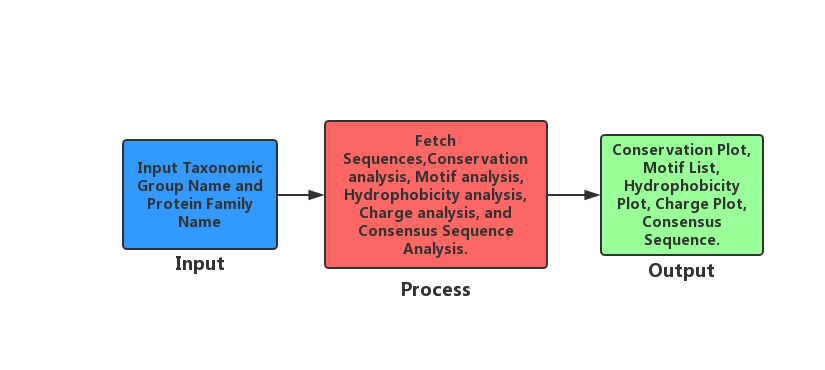

# Protein Sequence Analysis Script

### \*\*\*\*[**GitHub Repository Address** ](https://github.com/B153665-2019/B153665-2019.Assignment2)\*\*\*\*

## Process Flow:

## Description:

A one key Python script to automatically obtain protein sequences from NCBI based on user-defined dataset which includes Taxonomic Group, Protein Family Name. And follow through Conservation analysis, Motif analysis, Hydrophobicity analysis, Charge analysis, and Consensus Sequence Analysis.

## Requirements:

<table>
  <thead>
    <tr>
      <th style="text-align:left"><b>Script Version:</b>
      </th>
      <th style="text-align:left">Version 1.0</th>
    </tr>
  </thead>
  <tbody>
    <tr>
      <td style="text-align:left"><b>System Requirement:</b>
      </td>
      <td style="text-align:left">UNIX</td>
    </tr>
    <tr>
      <td style="text-align:left"><b>Software Requirement&#xFF1A;</b>
      </td>
      <td style="text-align:left">
        
Entrez Direct Package

        
BLAST

        
EMBOSS Package

        
Clustal Omega

      </td>
    </tr>
    <tr>
      <td style="text-align:left"><b>Python Requirement:</b>
      </td>
      <td style="text-align:left">Python 3.6</td>
    </tr>
  </tbody>
</table>