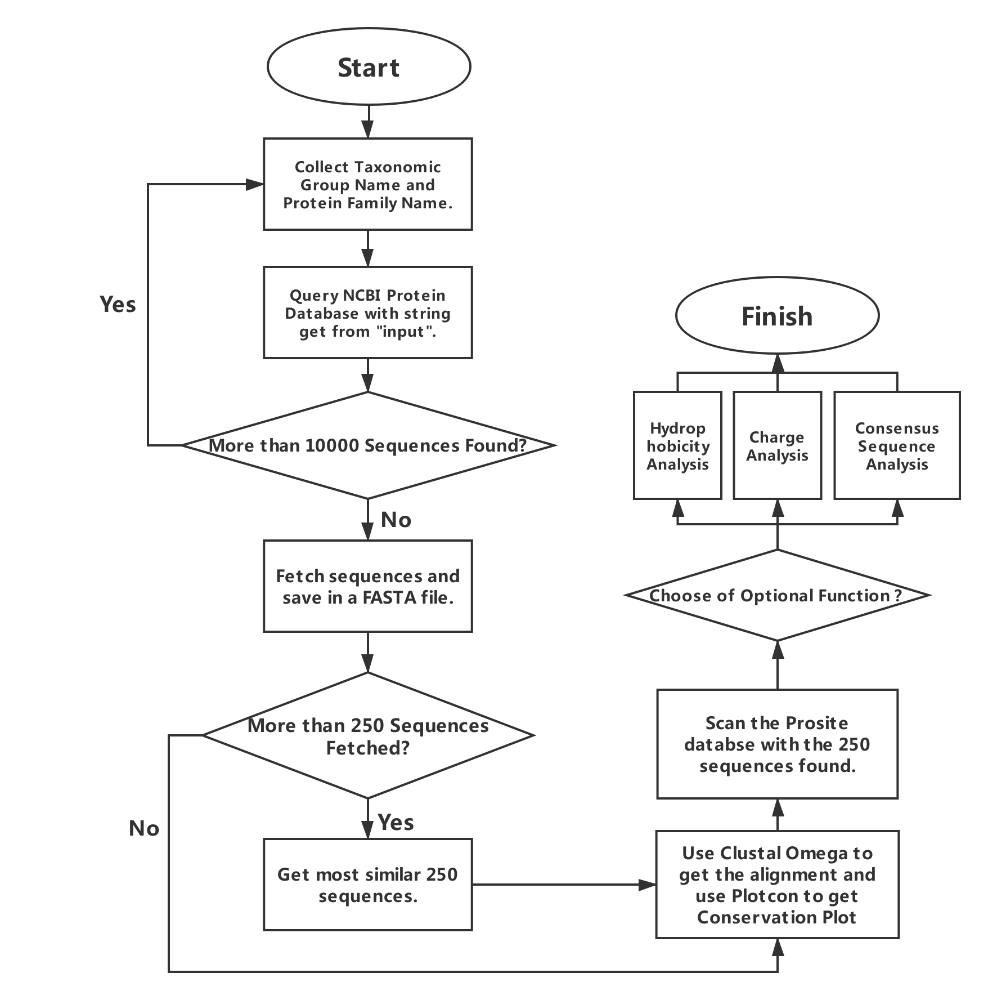

# Manual - for Professional User

## Flow Chart:



* For the Python package, the following packages we imported.

```python
import os #For using edirect, EMBOSS, and Clustal Omega
import re #Regular Expression
import xml.etree.cElementTree as et #XML file processing
```


